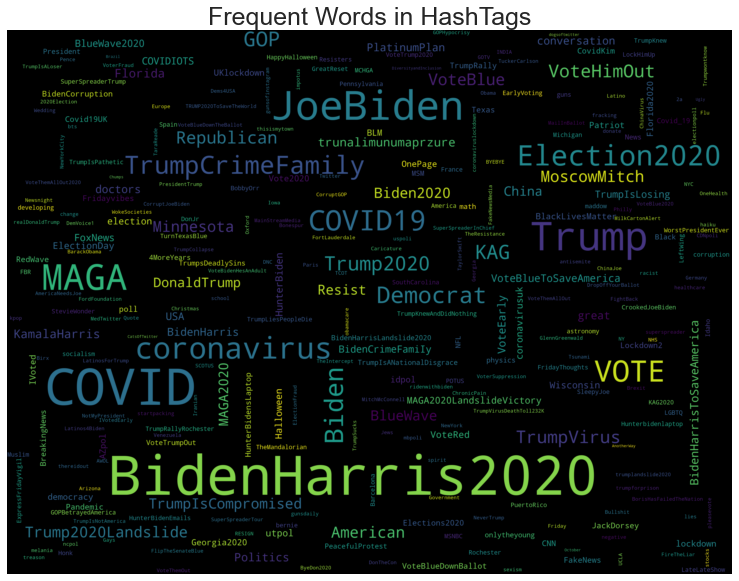
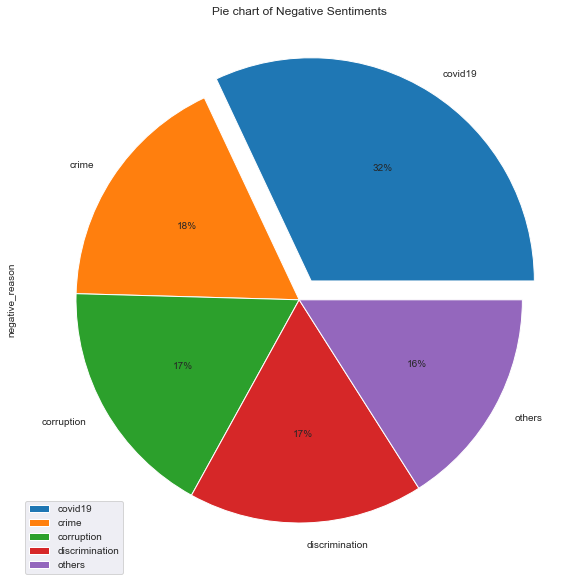
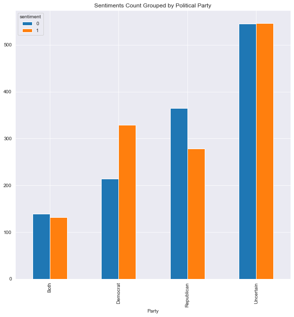

# Sentiment Analysis for prediciting 2020 US election results.

This project sheds light on Twitter sentiment on the 2020 US presidential election candidates/political parties. 
Understanding and predicting what the american population is thinking can play a major role in making critical business decisions.

  

LIBRARIES USED:
1. NLTK
2. Scikit-Learn
3. MatplotLib
4. Pandas
5. Numpy
6. Seaborn
7. WordCloud
8. Regex
9. itertools
10. graphviz

### Data Collection

The data was collected using Twitter API for several people in the US. 
A list of stopwords was created to remove non essential words from collected data. 
Using the correct Corpus is critical for this project, hence a custom corpus was also used to ensure we are able to understand sentiment of different words.

### Data Cleaning/Process

The following code block was used as one of the step for preprocessing data

### A fucntion to replace all the HTML tags and special characters with ''

### Remove HTML ASCII

def clean_ascii(text):
    text = html.unescape(text)
    return text

### Function to clean dataframes of HTML Tags

def clean_dataframe(df,col):

    # Extracting the twitter handle
    
    df['twitter'] = df[col].map(lambda x: re.findall('@(?=\w+)\w+',x))
    
    # Extracting Hastags
    df['hashtags'] = df[col].map(lambda x: re.findall('#(?=\w+)\w+',x))
    
    #cleaning tags
    df[col] = df[col].map(lambda x: re.sub(r'<[^>]+>', '', x))
    
    #cleaning all urls
    df[col] = df[col].map(lambda x: re.sub(r'http\S+', '', x))
    df[col] = df[col].map(lambda x: re.sub('https?:\/\/\w+\S+', '', x))
    df[col] = df[col].map(lambda x: re.sub('\w+\.\S+', '', x))
    df[col] = df[col].map(lambda x: re.sub('https?', '', x))
    df[col] = df[col].map(lambda x: re.sub('www\.\w+\S+', '', x))
    
    #remove ascii
    df[col] = df[col].apply(clean_ascii)
       
    # cleaning punctuations and special characters (Note we are not removning # for hashtags in the future)
    df[col] = df[col].map(lambda x: re.sub(r'[^\w\s]','',x))
    df[col] = df[col].map(lambda x: re.sub(r'[?|$|.|!|@|&]','',x))

    # cleaning leading and trailing spaces
    df[col] = df[col].map(lambda x: x.strip())

    return df #,twitter, hashtags

### Removing the stop words
def clean_stopWords(df,col):
    
    df['clean'] = df[col].apply(lambda x: " ".join([word for word in x.split() if word not in stop_words]))
    
    return df
    
    
    
### A function to change the strings to lower case
def clean_lower_text(text):
    text.lower()
    
    return text

### a text joining function for joining tokenized text

def join(text):

    text = " ".join(text)
    return text

### Visualization

After processing and EDA step I visualized data following are some of the images.
   

    The first image of word frequency in the Tweets
    

    
This image shows negative sentiment images and what are the main topics they are focused on
    

    
This bar graph showcase tweet count based on sentiment for different politcal parties (republican and democrat) where 0 being negative and 1 being positive tweet. 
    
Uncertain tweets are where the tweet didnot mention about the parties.
    

# MACHINE LEARNING MODEL

There were seven models used to predict the sentimanet of the tweets. 
1. Logistic Regression
2. KNN
3. Naive Bayes
4. Support Vector Machine
5. XGBoost
6. Ensemble (Randome Forest)
7. Decision Tree

Note to vectorize the data for model implementation Bag of Words and TF-IDF were used.

